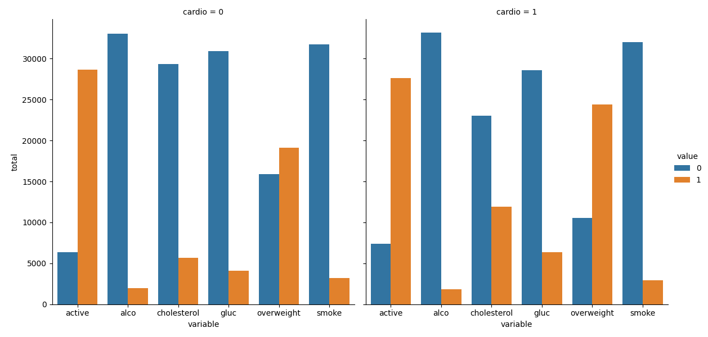
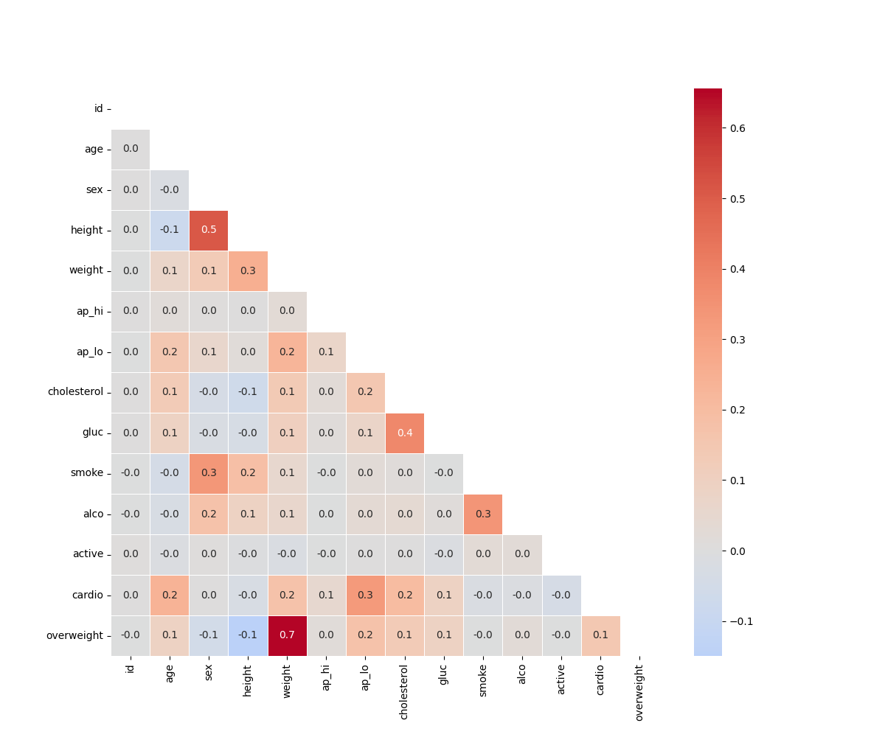

# Medical Data Visualizer

This project is a solution for the freeCodeCamp Data Analysis with Python: Medical Data Visualizer project.

## Project Overview

The Medical Data Visualizer analyzes a dataset of medical examination records and produces two main visualizations:

1. **Categorical Plot (catplot)**: Shows the distribution of several health-related variables, split by the presence or absence of cardiovascular disease.
2. **Heatmap**: Displays the correlation matrix of the dataset's features, helping to identify relationships between variables.

## Example Outputs

### Categorical Plot



- This plot shows the counts of each value (0 or 1) for variables like cholesterol, glucose, smoking, alcohol intake, physical activity, and overweight status, separated by cardiovascular disease status (`cardio`).

### Heatmap



- The heatmap visualizes the correlation coefficients between all pairs of variables in the dataset, with the upper triangle masked for clarity.

## Setup Instructions

1. **Clone the repository** and navigate to the project folder.
2. **Install dependencies** (you can use pip or conda):
   ```bash
   pip install pandas matplotlib seaborn numpy
   ```
3. **Place the dataset** `medical_examination.csv` in the project root directory.

## Usage

To generate the plots and run the tests, execute:

```bash
python main.py
```

- This will generate `catplot.png` and `heatmap.png` in your project directory.
- The script will also run unit tests to verify the correctness of the visualizations.

## File Structure

- `medical_data_visualizer.py` - Main analysis and plotting code
- `main.py` - Entrypoint for running the project and tests
- `test_module.py` - Unit tests for the visualizations
- `examples/` - Example output images
- `README.md` - Project documentation

## License

This project is part of the freeCodeCamp curriculum and is intended for educational purposes.
